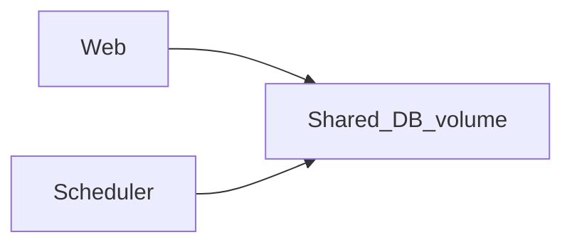

# Operations Runbook

This document covers running the fraud detection stack reliably: Docker, scheduler separation, backups, health checks, and recovery.

## Architecture (recommended)

- **Web** (`run.py` / gunicorn `wsgi:application`): HTTP API + dashboard only. Set `SKIP_EMBEDDED_SCHEDULER=1` so APScheduler does not run inside the web process.
- **Scheduler** (`python scheduler.py`): APScheduler pipeline (fetch → analyze → enrichment hooks). One process only.
- **SQLite**: Single file (default `affiliate_data.db`, or `DB_PATH`). WAL mode is enabled by the app for safer concurrent reads.



## Docker Compose

Two services share the `fraud_db` volume so both see the same database file under `/data/affiliate_data.db`.

```bash
docker compose up -d --build
```

**Image name:** `fraud-detection` (tag via `IMAGE_TAG`, default `latest`). DigitalOcean example:

```bash
docker tag fraud-detection:latest registry.digitalocean.com/<registry>/fraud-detection:latest
docker push registry.digitalocean.com/<registry>/fraud-detection:latest
```

- **Web**: `http://localhost:${PORT:-5050}` (maps host port to container `5050`).
- **Scheduler**: no exposed ports; runs `python scheduler.py`.

### Production deploy (e.g. `fraud.gptoolz.com`)

Set secrets via environment (see [`.env.example`](../.env.example)), not `config.json`:

| Variable | Purpose |
|----------|---------|
| `FLASK_SECRET_KEY` | **Required** — signs encrypted admin2 session cookies |
| `FRAUD_DETECTION_API_KEY` | Affiliate export API |
| `WEBHOOK_INGEST_TOKEN` | Inbound webhook auth |
| `ADMIN_API_USERNAME` / `ADMIN_API_PASSWORD` | **Scheduler only** — background enrichment |
| `ADMIN2_LOGIN_REQUIRED` | `1` (default) — prompt each user for admin2 on load |

**Web users** must sign in with their own admin2 credentials to use the dashboard (session gate on all `/api/*` except health + auth). Put HTTPS termination on the reverse proxy in front of gunicorn.

### Migrating from the old single-service compose

Previously a single service `fraud-detection` ran the web app with an embedded scheduler. Replace with `web` + `scheduler`. Your existing named volume data is preserved if the volume name is unchanged (`fraud_db`).

## Environment variables

See [`.env.example`](../.env.example). Highlights:

| Variable | Purpose |
|----------|---------|
| `DB_PATH` | SQLite file path |
| `SKIP_EMBEDDED_SCHEDULER` | Set `1` on web when running standalone `scheduler.py` |
| `FRAUD_DETECTION_API_KEY` | Affiliate export API key |
| `WEBHOOK_INGEST_TOKEN` | Bearer token for `/api/webhook/ingest` |
| `FLASK_SECRET_KEY` | **Required in production** — admin2 session encryption + Flask sessions |
| `ADMIN2_LOGIN_REQUIRED` | Prompt for admin2 on dashboard load (`1` default) |
| `ADMIN_API_USERNAME` / `ADMIN_API_PASSWORD` | Scheduler enrichment only (not web UI) |
| `WEB_CONCURRENCY` | Gunicorn `--workers` (default `1` for SQLite) |
| `LOG_FORMAT` | `text` or `json` |
| `LOG_TO_STDOUT_ONLY` | `1` to log only to stdout (typical in containers) |

## Production HTTP server

The Docker image runs **gunicorn** against `wsgi:application` (not Flask’s development server).

Local alternative:

```bash
pip install gunicorn
export SKIP_EMBEDDED_SCHEDULER=1   # if scheduler runs separately
gunicorn -w 1 -b 127.0.0.1:5050 wsgi:application
```

Use **1 worker** with SQLite unless you understand write-lock contention; raise workers only after moving to a client/server database.

## Health checks

| Endpoint | Use |
|----------|-----|
| `GET /api/health` or `GET /api/health/live` | **Liveness** — process up, no DB call |
| `GET /api/health/ready` | **Readiness** — DB ping, last pipeline summary, scheduler summary, enrichment backlog |

Load balancers: point **liveness** at `/api/health/live` and **readiness** at `/api/health/ready`.

Docker Compose / Portainer stacks include a **healthcheck** on the web service that hits `/api/health/live`. Prefer `ready` for deployment gates and load-balancer readiness; use `live` for container health so brief SQLite locks do not mark the container unhealthy.

## Secrets and sessions

| Variable | Notes |
|----------|--------|
| `FLASK_SECRET_KEY` | **Required in production** — signs Flask sessions and encrypted admin2 credentials in the cookie |
| `REQUIRE_FLASK_SECRET_KEY=1` | Fail fast at startup if `FLASK_SECRET_KEY` is empty (enabled in prod compose) |
| `SESSION_COOKIE_SECURE` / `TRUST_PROXY_HTTPS` | Set when serving over HTTPS so session cookies are marked Secure |
| `SESSION_COOKIE_SAMESITE` | Default `Lax` |

Rotating `FLASK_SECRET_KEY` invalidates all existing admin2 sessions (users must sign in again).

## Job coordination (SQLite)

Web manual fetch/analysis/enrichment and the scheduler share a named SQLite lock (`job_locks` table, name=`pipeline`). Concurrent starts return **HTTP 409**. Stuck `pipeline_runs` rows older than `scheduler.stale_run_hours` (default 12) are marked failed on web/scheduler boot.

## Backups (SQLite)

Use the online backup script (works with WAL):

```bash
python scripts/backup_sqlite.py --db affiliate_data.db --dest backups --keep 30
```

Schedule with cron or launchd on the host running the DB file. In Docker, run the script from a cron sidecar or the host against a mounted path.

**Restore**: stop web + scheduler, copy backup file over `DB_PATH`, restart services.

## macOS: standalone scheduler

See [launchd/README.md](launchd/README.md). Use `SKIP_EMBEDDED_SCHEDULER=1` for the web app so only one scheduler runs.

## Logs

- **Rotating file** `fraud_detection.log` (unless `LOG_TO_STDOUT_ONLY=1`).
- **JSON lines**: `LOG_FORMAT=json` for simple aggregation.

## Troubleshooting

| Symptom | Check |
|---------|--------|
| Duplicate pipeline runs | Only one scheduler process; web has `SKIP_EMBEDDED_SCHEDULER=1` |
| Readiness 503 | `DB_PATH` writable, disk full, DB corrupted |
| Stale data | `GET /api/scheduler/status`, `pipeline_runs` table, scheduler logs |
| Webhook 401 | `WEBHOOK_INGEST_TOKEN` matches sender |

## Security notes

- Do not commit `config.json` with secrets; prefer env vars for production.
- Restrict network access to the dashboard in production (VPN, internal bind, reverse proxy).
